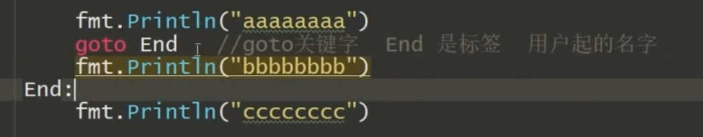

::: tip

正在崛起的后端语言

:::

<!-- more -->

---

## 语法

### Switch

每句自动 break 若想继续下去 加 fallthrough

### Range

迭代打印 会返回两个值 第一个是元素位置 第二个是元素本身 常用于 for 循环 如 i，date:= range str（变量）

### break 和 continue

break 跳出距离最近的循环 可在 for 和 switch 里使用

continue 跳过本次循环 只能在 for 里使用

### goto

跳转到某一语句 如下图



### 字符串

#### String.Contains(被检查字符串，检查字符串)

返回值是 bool 类型，查找一个字符串在另一个字符串中是否出现

#### String.index(被检查字符串，检查字符串)

返回值是 int 类型，查找一个字符串在另一个字符串中的位置下标，-1 表示找不到，0 表示第一个位置

#### String.join(字符串切片，连接符)

返回值是字符串，用于字符串的连接，连接在每两个切片元素之间

#### String.split(string,分割点字符)

将字符串成切片，返回值是切片，故可以取其下标，打印某个位置字符

#### String.repeat(string，int（重复次数）)

返回值是 string 类型，重复输出字符串

#### String.replace(string,原词，替换词，替换个数)

替换内容，可用于屏蔽敏感词。当个数小于零时，即全部原词部分替换

#### String.trim(string,去掉的字符)

去掉字符串头尾的内容，用于整理字符串

#### String.field(string)

用于去掉字符串中的空格，转成切片，可用 for 循环来统计单词个数

#### Strconv.formatint(int,进制)

将数字转换不同进制

### 数组

对两个数组拷贝可以用 copy(s,s1)即可

Map 函数 m:=map[int]string{1:"张山",2:"王五",3:"李四"}

### 对象

暂无笔记

### 结构体

结构体数组或切片书写格式，注意若是结构体则每个元素前要表明结构体数据类型

```go
var s [3]student=[3]student{
student{"a",18,"男"},
student{"b",19,"女"},
student{"v",12,"女"}}
```

### 指针

```go
a:=[4] int{1,3,35}
var p *[4]int //是一个数组指针，专门指向数组，
p=&a    //但要求数组内存与数组指针大小一致
var p [3]*[3]int=[3]*[3]int{&a,&b,&c} //数组的指针数组，即数组里存放的元素都是指针数组
```

### 不定参

可写任意数量的参数 不定参数必须放在固定参数后面 可以不写入

格式： func run(agrs ... int) //参数名 ... type

相当于一个集合 可以用函数 len(agrs)来计算集合个数

### 匿名变量

作用:丢弃数据

### 切片

概述：可看作不需要指定长度的数组

- 函数形参(arr...)可调用全部参数 若为 arr[0:4] ... 即从第一个元素到第三个元素 不包含第四个 若为 arr[0:4] 则包含第四个

- 切片容量在 1024 前都是以两倍扩容

      	切片的截取:  s:=slice[low:high:max]

      	若全部截取:  s:=slice

      	截取后的切片与原切片地址一样，修改截取后的切片会同时修改原切片内容

- 切片与指针的联系，切片内存的是地址，没有下标，因此指针需先\*取值后才能写下标进行修改

- 切片数据是放在堆区的

      	 

### 栈区

储存原理: 先进后出 后进先出

### 随机数

rand.Seed(time.Now().UnixNano()) //创建随机生产数种子

如 v:=rand.Intn(4) 随机数 0 到 3

## 延迟

延迟调用 defer

Recover()函数在 defer 函数中使用,作用防止程序崩溃

### 文件

Fp.write(字符串切片，int 位置)指定位置输入

Os.open()只是以只读的方式打开文件，os.openfile()则可以选择多种模式

### 其他

- new 函数相当于 c 语言的 malloc 函数，但不用释放内存

- 多重继承要按顺序赋值

      	子类可以继承父类的属性和方法，而父类不可继承子类

## 功能

### 数据类型别名：

type abc int 即把 int 名称改为 abc 使用时两个名称都可以用

## 问题

### 创建文件失败原因

1. 路径不存在
2. 文件权限
3. 打开文件达到上限

### 某区域变黄块：

选中，alt+enter,选不再报告此函数

## 注意

高类型转换为低类型 会丢失精度 数据溢出 符号发生改变

不同级目录下引用，其引用函数名要大写，同级目录下的包声明要一致，不同级要不一致
