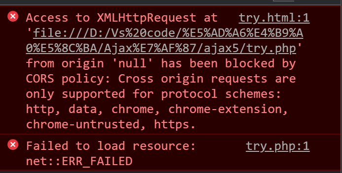
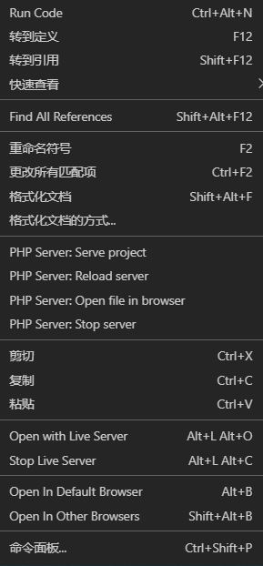

::: tip

网络热梗----PHP 是世界上最好的语言！

:::

<!-- more -->

---

## 使用及功能：

### cmd 查看端口

```cmd
netstat -aon 查看端口
netstat -ano|findstr "8080" 查看8080端口
taskkill -PID 992 -F 停止某端口
```

### [php 自动补全](http://www.bubuko.com/infodetail-3212164.html)

### 逆序输出

```php
foreach (array_reverse($rows) as $key => $msg) //加上array_reverse
```

### php 传值给 js 并处理数据

```php
//用+号分隔字符串
echo $user['name'] . "+" . $user['qqMailbox']."+".$user['phone']. "+" .$user['key'];
```

```js
//可以在js中分割
var user = this.responseText.split('+')
```

## 语法：

#### 引用 全局变量

```php
// 函数内使用global $i,使$i可以被外部访问到，扩大作用域
// 定义global $i=0;语法错误，定义时不可赋值
$i = 0;
function a()
{
    global $i;
    $i += 3;
    echo ' ' . $i;
}
echo ' ' . $i;
a();
echo ' ' . $i;  // 输出结果 0 3 3

更简单的方法为 传参是加上引入&，即不会被释放
```

#### 引用&

```php
如果变量为对象，那么在某函数使用后不会被释放，仍会改变值.
因为在PHP中，传入参数为对象的话并不是把对象复制一份进行操作（常见情况如此），而是直接操作该对象.
&$i,即类似对象传递，是直接更改原变量的
```

#### html 镶入变量

```php
// 在PHP中不用转义输出一段html代码，注意起始和尾部可以为其他字符，但要相同。尾部一定要置顶，不得有空格。此方法方便快速使用变量，不改变作用域
$html = <<<END
            <tr>
                <td><input class="sort" type="text" name="sort" /></td>
                <td>{$data['module_name']}[id:{$data['id']}]</td>
                <td><a href="#">[访问]</a>&nbsp;&nbsp;<a href="#">[编辑]</a>&nbsp;&nbsp;<a href="#">[删除]</a></td>
            </tr>
END;
                echo $html;
```

#### 数组类

```php
获取数组长度
$length=count($array);
```

```php
字符串转化为数组
$_POST = str_split($_POST['selectID'], 2); // 切割两个字符为一元素
$_POST = explode(',', $_POST['selectID']); // 分割字符串
```

```php
count($arr)							// 计算数组长度

reset($arr)							// 返回数组第一个单元的值

key($arr) 							// 返回数组中当前单元的键名

end($arr) 							// 将 array 的内部指针移动到最后一个单元并返回其值。

// 将 array 的第一个单元移出并作为结果返回，将 array
// 的长度减一并将所有其它单元向前移动一位。所有的数字键名将改为从零开始计数，文字键名将不变
array_shift($arr)

// 弹出并返回 array 数组的最后一个单元，并将数组 array 的长度减一。
array_pop($arr)

array_unshift($arr,$var)			// 插入$var到数组头部位置

array_push($arr,$var)				// 插入$var到数组尾部位
```

## 碰到的 bug:

### undefind index:name

原因之一:用户名输入错误，使 name 为空，则未定义

### 数据库 数据添加不成功

还要注意 引号和分号使用是否正确,如 value (`name`) 里边使用引号，但应该为字符串，故要改为单引号''

### 请求头问题





要用 PHP server 打开 而不是 open in default browser 打开

### Error：Array to string conversion

Array 数组被当作字符串使用 如 echo (“$a”) 或echo $a，要用 var_dump 函数

### 使用 pdo 1054 连接不上数据库

[解决办法](https://blog.csdn.net/m0_46278037/article/details/113923726)

## 注意：

- echo 不能输出 bool 值，要用 var_dump()
- 在 xhr.onload=functionn 中传返回值无效
- Print_r 可以输出数组或对象，PHP fetchAll 后可以 user[‘name’]即是 name 的字符串
- 用 form 注意给每个标签写上 name=”",才能把输入框内的值 post 上去
- onsubmit="return \$judge" 控制 action 执行
- [Form 中按钮 button submit 区别](http://blog.sina.com.cn/s/blog_693d183d0100uolj.html)
- Update 数据库要 MySQL -u root-p 启动服务后才能更新
