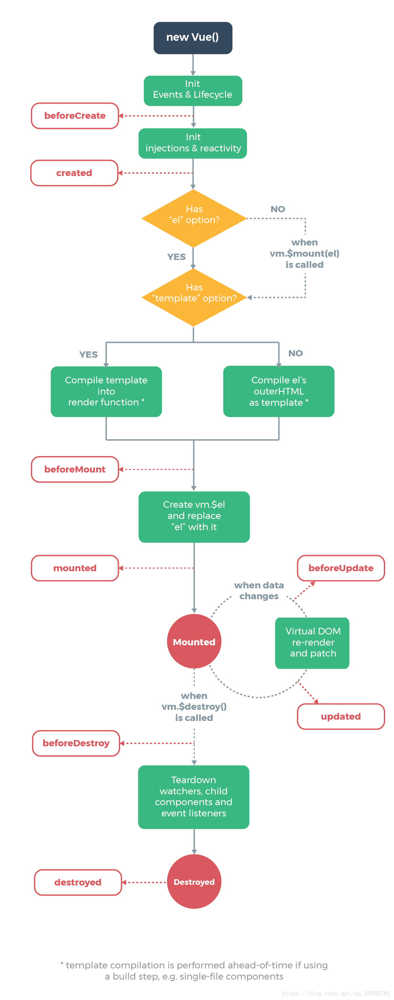
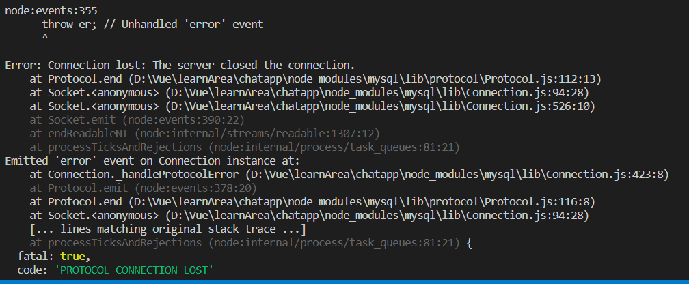

::: tip

前端框架 特别好用

:::

<!-- more -->

---

## 上手：

### [安装 vue 配置](https://www.cnblogs.com/zhaomeizi/p/8483597.html)

### [安装 devtool](https://blog.csdn.net/weixin_38654336/article/details/80790698)

### vue 创建项目流程

创建项目 必须 cd 到对应项目里面

```cmd
vue init webpack vue-demo01 / vue create vue-name  可以自定义名称
cd  vue-demo01
cnpm install  /  npm install
```

如果创建项目的时候没有报错，这一步可以省略。

如果报错了 cd 到项目里面运行

```cmd
cnpm install  /  npm install
npm run dev/npm run start/npm run serve  启动项目
```

### 好用的工具

### bootstrap

css 排版布局及 ui，移动设备优先

### vant

ui 设计与 bootstrap 类似

### less

css 预编译处理

### nodemon

使用 nodemon index.js 代替 node index.js 启动 js 终端 ，界面更优化

### axios

Ajax 是 MVC 模式，且要引入整个 jQuery,项目太大

axios 是 MVVM(modex---view---view-model 模式)，轻量且提供多个请求接口

### Shortid

随机生成短 id 号

扩展安装 vue2 全家桶 17 课 项目(总文件夹)终端打开

输入 npm i shortid --save 即可安装

### moment

介绍：处理时间戳，转化为正常时间

安装：npm install moment --save

使用：moment(value).format(format1) 使 value 按 format1 的格式输出，format1 为自定义，如：YYYY-MM-DD HH-MM-SS (此错误，月日与分秒字符相同，无法针对分秒或月日做出改变)

应为 YYYY-MM-DD HH-mm-ss 一个时间格式

### animate.css

好看的动画效果

nmp install animate.css --save

## 语法：

### 基础

- :和@

冒号：代表 v-bind 绑定

@代表 v-on 监听

v-once 只使用一次传入数据 之后静态不会改变

- V-for

V-for 中的:key 绑定 key 是为了使该 div 是唯一标签，不会使用另一同名 div

- v-html

v-html 可在 vue 中插入 HTML 标签，如变量 a:<span>hello</span>,html 中{{a}},则只把 span 当成字符串，加入 v-html 会自动识别

- computed 和 watch

computed 得到多个数据变化计算一个结果，watch 得到一个数据变化去影响多个结果

computed 属性有 get() 得到数据， set() 得到结果并计算影响数据，数据双向绑定

watch 监听的变量可看成一个方法，数据单向绑定

- this.\$root 访问最顶层的父级组件

- 数组操作

      	插入数组

      	this.persons.unshift(this.newPerson)

      	删除某一项数组 splice(index,len,[item]) 下标，删除长度(若为2，删除两个数组，item 替换内容)

      	如：this.persons.splice(index,1)

### JSON

- JSON.stringfy(obj)

      	将数据字符串化，如obj:3,则转化后’obj’： ‘3’ ，JSON.prase(obj) 将数据转换成对象

      	常用于localStroge与前后端的数据交互，获取localStroge要JSON.prase(obj)解析，存放到localStroge时要JSON.stringfy(obj)格式化

- JSON.Stringify(value)

      	把对象的每一字段转变为字符串

- JSON.prase(value)

      	解析对象

### localStroge

localStroge.clear();清除本地缓冲

### 生命周期

图解



### 解析 ...

let arr=[...persons]; 使 arr 接受 persons 的全部数据；arr=person 也行

### 时间

new Date() 产生一个新的时间

### 异步

async 异步的意思 异步函数也就意味着该函数的执行不会阻塞后面代码的执行，且会效果置于后面展示。

[async 与 await 详解](https://www.cnblogs.com/zhoujuan/p/11692818.html)

### Router

跳转页面：this.\$router.push('about')

### 单向数据流

由数据源（data）控制视图（thml 部分），而视图有特定的动作（methods）触发，于是动作 actions 又改变数据源，数据源接着改变视图，形成一个循环

### 插槽

将子组件在父组件的<slot></slot>标签位置显示

[插槽详解](http://caibaojian.com/vue-slot.html)

## 功能：

### [关闭 ESLint 强制语法规则](https://blog.csdn.net/qq_36888550/article/details/79815195)

### 自定义全局或局部指令：

```vue
directive:{id(指令名),(el,binding)=>{
el.textContent=binding.value.toUpperCase()}
```

id 为指令名，el 为 html 标签，binding 为绑定的标签的内容。全局在 main.js 里定义，局部在部件 vue 中定义

### 动画效果

```css
.fade-enter,
.fade-leave-to {
  opacity: 0; //刚进入和完全离开时透明度为零
  transform: traslateX(200px); //移动200px
}
.fade-enter-active,
.fade-leave-active {
  trasition: all 2s ease; //动画部分 时间 效果
}
```

## 冤家 bug:

### animate 动画效果无法显示问题

不能在 transition 里面添加 div,div 里面的标签可能会没反应，具体原因未知

### 已存在相同文件名

把文件夹，vscode，命令窗口都关闭再重开一下

### soket.io 连接问题

- 使用 socket.io 准备

      	服务端(后端)：

      	要npm install --save socket.io ,还可npm install -g nodemon 全局下载nodemon替换node,

      	客户端(前端)：

      	要npm install --save socket.io-client,然后在html文件中引入

- 报错

      	两端无法响应，并有status code 404警告，即客户端的client文件没有找到，无法引用。

- 解决

      	本人错误在直接导入socket.io 而不是client包下的socket.io.dev.js,因此小细节而花费四天时间，┗|｀O′|┛ 嗷~~，来自程序猿的卑微怒吼

### socket.io 无法跨域请求

```vue
socketio.io = require('socket.io')(server, { allowEIO3: true, cors: {
origin:["http://localhost:8080","http://127.0.0.1:8080"], // 添加请求头即可
methods: ["GET", "POST"], credentials: true}});
```

### 运行服务器时 Mysql 不使用一段时间会断开，且报错



所以要写个自动重连的回调（递归）函数

## 注意:

- 主件要名称大写
- 箭头函数有花括号要写 return

- computed 中 get 方法每条语句后要加；而不是， 逗号会引起语法错误

- style 里边要用分号隔开，逗号无效

- fade-enter-active,fade-leave-active{} 两个效果要加逗号，否则不生效
- This.element.filter 搜索符合的内容 .push 添加内容 .splice 删除内容
- vue 中 style 的 scoped 会使组件私有化，从而使用 ui 渲染组件后，添加进来的、未在源 html 出现的 div 会因 scoped 的限制无法得到 css 的样式修改，因此要慎用 scoped
